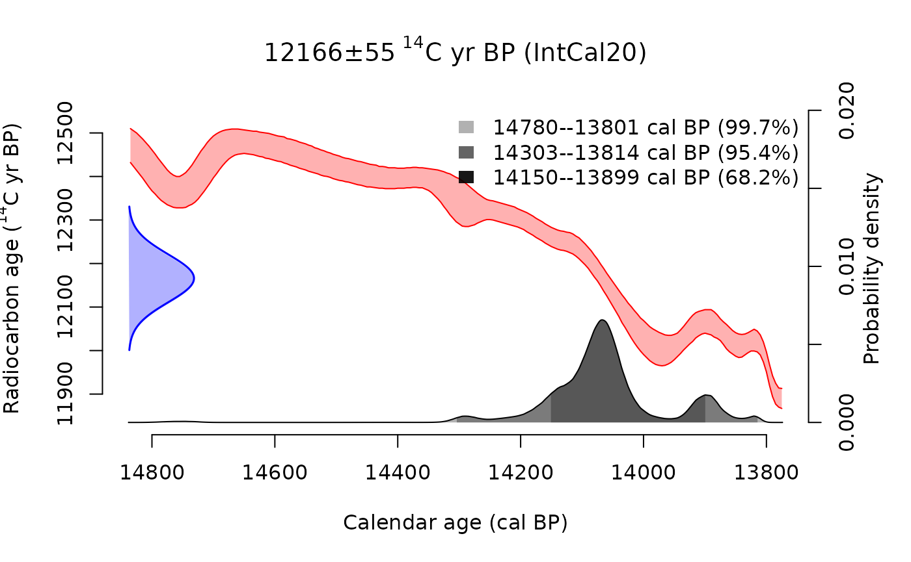
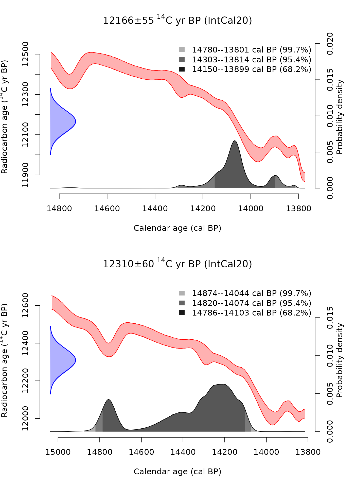
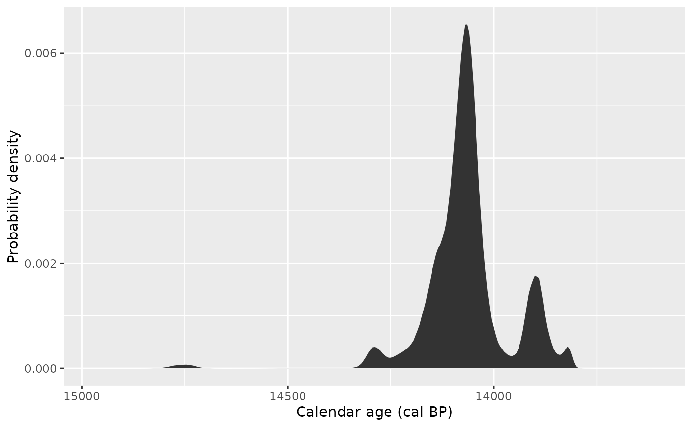
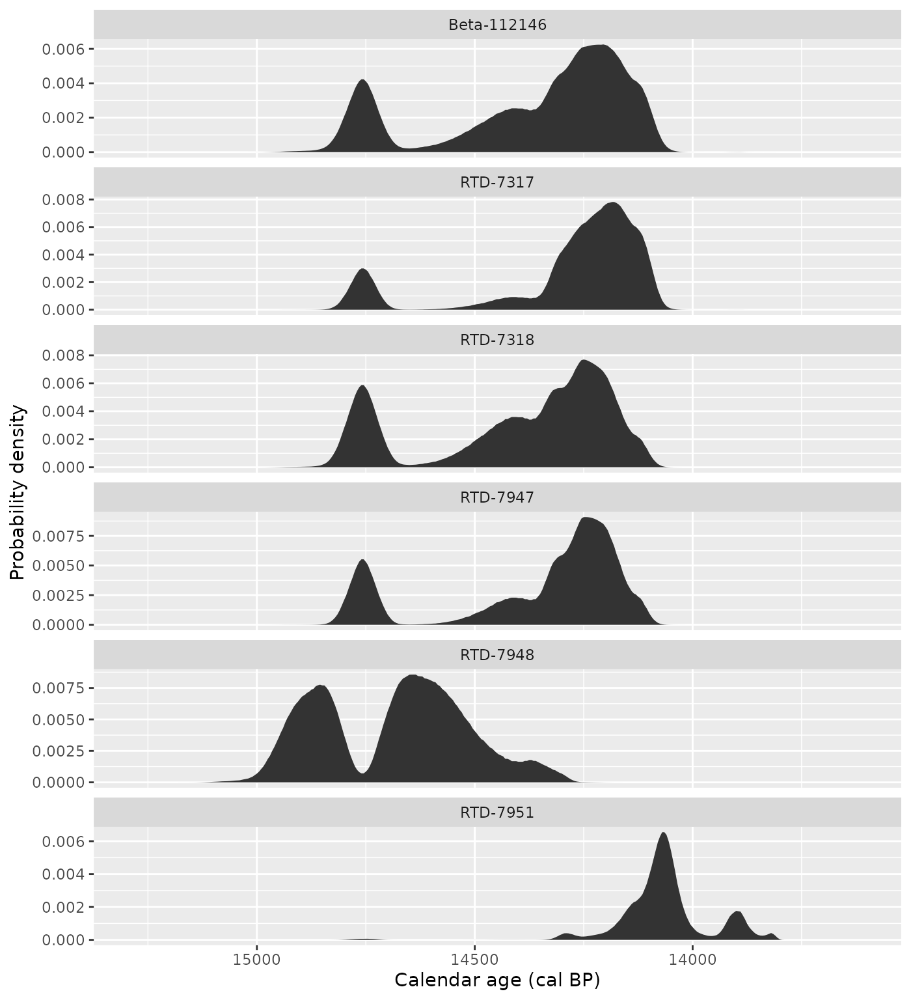
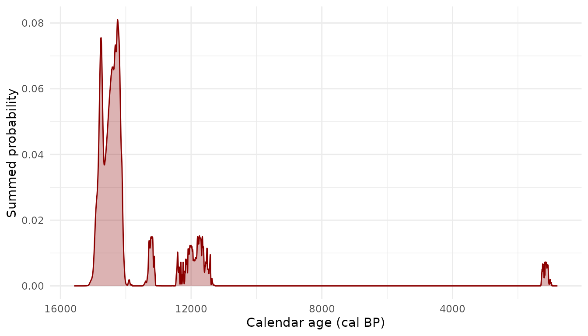
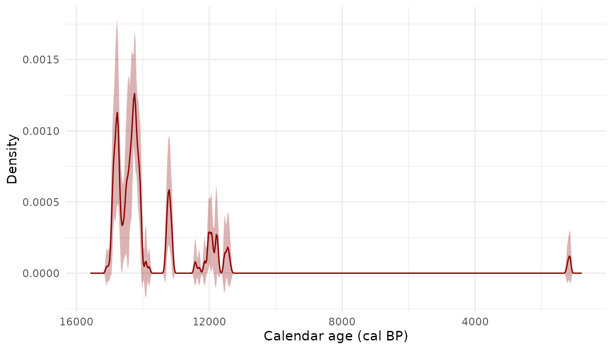
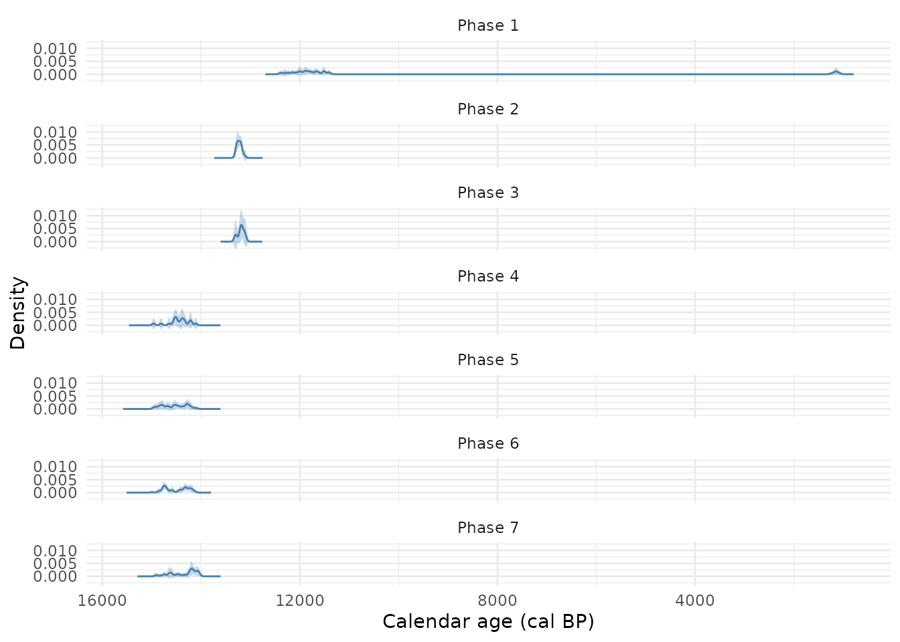

# Tidy radiocarbon data

**c14** makes it easy and intuitive to incorporate radiocarbon dating
into tidy data analysis workflows in R. It provides classes and
functions for radiocarbon data that fit nicely in tables and work well
with pipes and [dplyr](https://dplyr.tidyverse.org/) verbs.

This vignette introduces functions for the most common tasks when
working with radiocarbon data, including those for calibrating,
summarising, aggregating and plotting radiocarbon dates.

``` r

library("c14")
library("dplyr", warn.conflicts = FALSE)
library("tidyr")
library("ggplot2")
```

## Calibrating radiocarbon dates

[`c14_calibrate()`](https://c14.joeroe.io/reference/c14_calibrate.md)
calibrates conventional radiocarbon ages and their errors to a calendar
timescale:

``` r

c14_calibrate(5000, 30)
#> <c14_cal[1]>
#> [1] 5604–5891 cal BP
```

By default,
[`c14_calibrate()`](https://c14.joeroe.io/reference/c14_calibrate.md)
uses the IntCal20 calibration curve (Reimer et al. 2020), which is
recommended for terrestrial dates from the northern hemisphere. You can
change this with the `c14_curve` argument (see
[`?IntCal20`](https://c14.joeroe.io/reference/c14_curves.md) for the
available curves).

[`c14_calibrate()`](https://c14.joeroe.io/reference/c14_calibrate.md)
returns a *year with an era* (a
[`era::yr`](https://era.joeroe.io/reference/yr.html) vector), indicating
the age is expressed as calibrated years Before Present (‘cal BP’). Most
functions in the package return yrs and work with them internally to
ensure that calendric calculations are consistent.

Calibration is vectorised, so you can calibrate many dates at once:

``` r

ages <- c(5000, 6000, 7000)
errors <- c(30, 40, 50)

c14_calibrate(ages, errors)
#> <c14_cal[3]>
#> [1] 5604–5891 cal BP 6740–6946 cal BP 7705–7934 cal BP
```

This unlocks the real utility of the c14 package, which is embedding
calibration in a tidy workflow. For example, the `shub1_c14` dataset
(provided with the package) contains 27 radiocarbon dates from the
Epipalaeolithic site of Shubayqa 1 in eastern Jordan. We can calibrate
these dates within the data frame using dplyr’s
[`mutate()`](https://dplyr.tidyverse.org/reference/mutate.html) verb:

``` r

shub1_c14 |>
  mutate(cal = c14_calibrate(c14_age, c14_error))
#> # A tibble: 27 × 9
#>    lab_id      context phase   sample         material c14_age c14_error outlier
#>    <chr>         <int> <chr>   <chr>          <chr>      <int>     <int> <lgl>  
#>  1 RTD-7951         23 Phase 7 Context 126, … Bolbosc…   12166        55 FALSE  
#>  2 Beta-112146      24 Phase 7 SHUB1/105      gazelle…   12310        60 FALSE  
#>  3 RTD-7317         26 Phase 7 Context 83, S… Bolbosc…   12289        46 FALSE  
#>  4 RTD-7318         27 Phase 7 Context 86, S… Zilla s…   12332        46 FALSE  
#>  5 RTD-7948         24 Phase 7 Context 120, … Bolbosc…   12478        38 FALSE  
#>  6 RTD-7947         22 Phase 6 Context 166, … Bolbosc…   12322        38 FALSE  
#>  7 RTD-7313         22 Phase 6 Context 67, K… Bolbosc…   12346        46 FALSE  
#>  8 RTD-7311         22 Phase 6 Context 67, K… Vitex s…   12367        65 FALSE  
#>  9 RTD-7312         22 Phase 6 Context 67, K… Zilla s…   12405        50 FALSE  
#> 10 RTD-7314         22 Phase 6 Context 67, K… Bolbosc…   12273        48 FALSE  
#> # ℹ 17 more rows
#> # ℹ 1 more variable: cal <cal>
```

The `cal` column preserves the original data alongside the calibrated
dates, so you can continue working with the full dataset.

## Summarising calibrated dates

The table in the last example showed the highest density interval of the
calibrated radiocarbon date (at 95.4% probability – sometimes called the
‘2-sigma’ range) of the calibrated radiocarbon date, rather than its
full probability distribution. [^1] We can calculate this explicitly
with [`cal_hdi()`](https://c14.joeroe.io/reference/cal_hdr.md), which
also allows us to choose another probability value:

``` r

shub1_c14 |>
  mutate(
    cal = c14_calibrate(c14_age, c14_error),
    cal_hdi_1sigma = cal_hdi(cal, interval = 0.683)
  ) |>
  select(lab_id, c14_age, c14_error, cal, cal_hdi_1sigma)
#> # A tibble: 27 × 5
#>    lab_id      c14_age c14_error                cal cal_hdi_1sigma
#>    <chr>         <int>     <int>              <cal> <list>        
#>  1 RTD-7951      12166        55 13813–14303 cal BP <yr [2]>      
#>  2 Beta-112146   12310        60 14074–14821 cal BP <yr [2]>      
#>  3 RTD-7317      12289        46 14072–14803 cal BP <yr [2]>      
#>  4 RTD-7318      12332        46 14102–14820 cal BP <yr [2]>      
#>  5 RTD-7948      12478        38 14348–14980 cal BP <yr [2]>      
#>  6 RTD-7947      12322        38 14103–14811 cal BP <yr [2]>      
#>  7 RTD-7313      12346        46 14116–14828 cal BP <yr [2]>      
#>  8 RTD-7311      12367        65 14128–14850 cal BP <yr [2]>      
#>  9 RTD-7312      12405        50 14216–14878 cal BP <yr [2]>      
#> 10 RTD-7314      12273        48 14058–14804 cal BP <yr [2]>      
#> # ℹ 17 more rows
```

[`cal_hdr()`](https://c14.joeroe.io/reference/cal_hdr.md) always returns
a single region of the probability distribution – the shortest interval
containing the specified probability mass. Calibrated radiocarbon dates
are often multimodal, so it can be more accurate to consider one or more
highest density *regions*, which we can calculate with
[`cal_hdr()`](https://c14.joeroe.io/reference/cal_hdr.md):

``` r

c14_calibrate(8800, 30) |>
  cal_hdr()
#> [[1]]
#> [[1]][[1]]
#> # cal BP years <yr[2]>:
#> [1] 9681 9920
#> # Era: Before Present (cal BP): Gregorian years (365.2425 days), counted backwards from 1950
#> 
#> [[1]][[2]]
#> # cal BP years <yr[2]>:
#> [1] 9935 9956
#> # Era: Before Present (cal BP): Gregorian years (365.2425 days), counted backwards from 1950
#> 
#> [[1]][[3]]
#> # cal BP years <yr[2]>:
#> [1]  9995 10007
#> # Era: Before Present (cal BP): Gregorian years (365.2425 days), counted backwards from 1950
#> 
#> [[1]][[4]]
#> # cal BP years <yr[2]>:
#> [1] 10067 10116
#> # Era: Before Present (cal BP): Gregorian years (365.2425 days), counted backwards from 1950
```

The inverse of these two functions is
[`cal_probability()`](https://c14.joeroe.io/reference/cal_probability.md),
which calculates the probability that a calibrated date falls within a
specified time interval:

``` r

x <- c14_calibrate(1116, 30)
cal_probability(x, 970, 1060) # cal BP
#> [1] 0.8086552
```

Other functions for summarising calibrated radiocarbon dates include
various methods for calculating a point estimate (see
[`?cal_point`](https://c14.joeroe.io/reference/cal_mode.md)). Generally
speaking, there is no ‘good’ point estimate of a calibrated radiocarbon
distribution (Michczyński 2007), but these can nevertheless be useful
when working with a range or the full probability distribution is not an
option. In this case, the mode is a reasonable choice:

``` r

shub1_c14 |>
  mutate(
    cal = c14_calibrate(c14_age, c14_error),
    cal_mode = cal_mode(cal)
  ) |>
  select(lab_id, c14_age, c14_error, cal, cal_mode)
#> Warning: There were 8 warnings in `mutate()`.
#> The first warning was:
#> ℹ In argument: `cal_mode = cal_mode(cal)`.
#> Caused by warning:
#> ! `x` has more than one modal value. Only the first will be returned.
#> ℹ Run `dplyr::last_dplyr_warnings()` to see the 7 remaining warnings.
#> # A tibble: 27 × 5
#>    lab_id      c14_age c14_error                cal     cal_mode
#>    <chr>         <int>     <int>              <cal>         <yr>
#>  1 RTD-7951      12166        55 13813–14303 cal BP 14065 cal BP
#>  2 Beta-112146   12310        60 14074–14821 cal BP 14205 cal BP
#>  3 RTD-7317      12289        46 14072–14803 cal BP 14185 cal BP
#>  4 RTD-7318      12332        46 14102–14820 cal BP 14250 cal BP
#>  5 RTD-7948      12478        38 14348–14980 cal BP 14640 cal BP
#>  6 RTD-7947      12322        38 14103–14811 cal BP 14245 cal BP
#>  7 RTD-7313      12346        46 14116–14828 cal BP 14255 cal BP
#>  8 RTD-7311      12367        65 14128–14850 cal BP 14340 cal BP
#>  9 RTD-7312      12405        50 14216–14878 cal BP 14375 cal BP
#> 10 RTD-7314      12273        48 14058–14804 cal BP 14165 cal BP
#> # ℹ 17 more rows
```

Note that here we mean `summarise` in the sense of deriving summary
statistics from the calendar probability distribution. They return a
vector of the same length as the input and therefore in dplyr terms they
are *mutating* functions, not *summarising* functions; operations that
can be used with
[`dplyr::summarise()`](https://dplyr.tidyverse.org/reference/summarise.html)
are covered in the section below on [aggregating calibrated
dates](#aggregating-calibrated-dates).

## Plotting calibrated dates

### Base R plots

The package provides a default
[`plot()`](https://rdrr.io/r/graphics/plot.default.html) method for
calibrated dates which shows their probability distributions and the
calibration curve.

``` r

shub1_cal <- c14_calibrate(shub1_c14$c14_age, shub1_c14$c14_error)
plot(shub1_cal[1])
```



This default method plots all the calibrated dates passed to it. [^2]
You can arrange multiple plots with, for example, `par(mfrow)`:

``` r

par(mfrow = c(2, 1))
plot(shub1_cal[1:2])
```



``` r

par(mfrow = c(1, 1))
```

### ggplot2

Because c14 works with standard R data structures, it is straightforward
to build custom ggplots with ggplot2. The key is to use
[`cal_dist()`](https://c14.joeroe.io/reference/cal_dist.md) to extract
the probability distributions, then
[`tidyr::unnest()`](https://tidyr.tidyverse.org/reference/unnest.html)
to tidy them into a data frame.

[`cal_dist()`](https://c14.joeroe.io/reference/cal_dist.md) returns a
list of data frames, each with `age` and `pdens` columns. When stored in
a tibble as a list-column,
[`unnest()`](https://tidyr.tidyverse.org/reference/unnest.html) expands
each element into its own rows:

``` r

shub1_c14 |>
  slice(1) |>
  mutate(cal = c14_calibrate(c14_age, c14_error)) |>
  mutate(dist = cal_dist(cal)) |>
  unnest(dist) |>
  ggplot(aes(x = age, y = pdens)) +
  geom_ribbon(aes(ymin = 0, ymax = pdens)) +
  labs(x = "Calendar age (cal BP)", y = "Probability density") +
  scale_x_reverse()
```



You can plot multiple dates by faceting. The original data columns (like
`lab_id`) are preserved and can be used directly:

``` r

shub1_c14 |>
  slice(1:6) |>
  mutate(cal = c14_calibrate(c14_age, c14_error)) |>
  mutate(dist = cal_dist(cal)) |>
  unnest(dist) |>
  ggplot(aes(x = age, y = pdens)) +
  geom_ribbon(aes(ymin = 0, ymax = pdens)) +
  facet_wrap(vars(lab_id), ncol = 1, scales = "free_y") +
  labs(x = "Calendar age (cal BP)", y = "Probability density") +
  scale_x_reverse()
```



This makes it easy to compare dates across sites, phases, or any other
grouping in your data.

## Aggregating calibrated dates

c14 provides two methods for combining multiple calibrated dates into a
single summary distribution.

### Summed probability distributions

[`cal_sum()`](https://c14.joeroe.io/reference/cal_sum.md) adds up the
probability distributions of all dates in a vector. This is the simplest
aggregation method.

``` r

shub1_cal <- c14_calibrate(shub1_c14$c14_age, shub1_c14$c14_error)

summed <- cal_sum(shub1_cal)
```

``` r

sum_df <- vctrs::vec_data(summed)[[1]]

ggplot(sum_df, aes(x = age, y = pdens)) +
  geom_ribbon(aes(ymin = 0, ymax = pdens), fill = "darkred", alpha = 0.3) +
  geom_line(colour = "darkred") +
  labs(x = "Calendar age (cal BP)", y = "Summed probability") +
  scale_x_reverse() +
  theme_minimal()
```



You can also use the [`sum()`](https://rdrr.io/r/base/sum.html) method:

``` r

sum(shub1_cal)
#> <c14_cal_dist[1]>
#> [1] c. 14250 cal BP
```

### Composite kernel density estimation

[`cal_density()`](https://c14.joeroe.io/reference/cal_density.md) uses
composite kernel density estimation (cKDE) to produce a smoother summary
distribution. It resamples from each date’s probability distribution and
fits a kernel density estimate, with optional bootstrapping to estimate
uncertainty.

``` r

density_est <- cal_density(shub1_cal, bw = 30, times = 10)
density_est
#> # A tibble: 14,792 × 3
#>           age .estimate   .error
#>          <yr>     <dbl>    <dbl>
#>  1 789 cal BP  9.32e-21 2.09e-20
#>  2 790 cal BP  9.25e-21 2.05e-20
#>  3 791 cal BP  9.18e-21 2.01e-20
#>  4 792 cal BP  9.11e-21 1.96e-20
#>  5 793 cal BP  9.04e-21 1.92e-20
#>  6 794 cal BP  8.97e-21 1.87e-20
#>  7 795 cal BP  8.89e-21 1.83e-20
#>  8 796 cal BP  8.82e-21 1.78e-20
#>  9 797 cal BP  8.75e-21 1.74e-20
#> 10 798 cal BP  8.68e-21 1.70e-20
#> # ℹ 14,782 more rows
```

``` r

ggplot(density_est, aes(x = age, y = .estimate)) +
  geom_ribbon(aes(ymin = .estimate - .error, ymax = .estimate + .error),
              fill = "darkred", alpha = 0.3) +
  geom_line(colour = "darkred") +
  labs(x = "Calendar age (cal BP)", y = "Density") +
  scale_x_reverse() +
  theme_minimal()
```



The bootstrapped standard error (`.error`) gives a measure of
uncertainty in the density estimate.

### Stratified aggregation

Both methods can be stratified by a grouping variable. This is useful
for comparing periods or phases.

To compare groups, run the aggregation separately for each stratum:

``` r

phases <- unique(shub1_c14$phase)

phase_densities <- purrr::map(phases, function(p) {
  idx <- shub1_c14$phase == p
  cal_density(shub1_cal[idx], bw = 30, times = 10) |>
    mutate(phase = p)
}) |> bind_rows()

ggplot(phase_densities, aes(x = age, y = .estimate)) +
  geom_ribbon(aes(ymin = .estimate - .error, ymax = .estimate + .error),
              fill = "steelblue", alpha = 0.3) +
  geom_line(colour = "steelblue") +
  facet_wrap(~phase, ncol = 1) +
  labs(x = "Calendar age (cal BP)", y = "Density") +
  scale_x_reverse() +
  theme_minimal()
```



## References

Michczyński, Adam. 2007. “Is It Possible to Find a Good Point Estimate
of a Calibrated Radiocarbon Date?” *Radiocarbon* 49 (2): 393–401.
<https://doi.org/10.1017/S0033822200042326>.

Reimer, Paula J, William E N Austin, Edouard Bard, et al. 2020. “The
IntCal20 Northern Hemisphere Radiocarbon Age Calibration Curve (0–55 Cal
kBP).” *Radiocarbon* 62 (4): 725–57.
<https://doi.org/10.1017/RDC.2020.41>.

[^1]: In fact the object returned by
    [`c14_calibrate()`](https://c14.joeroe.io/reference/c14_calibrate.md)
    does not store the probability distribution at all, only generates
    it when needed.

[^2]: By default `plot(cal)` only draws up to 20 plots at a time; this
    can be controlled with `max.plot`.
